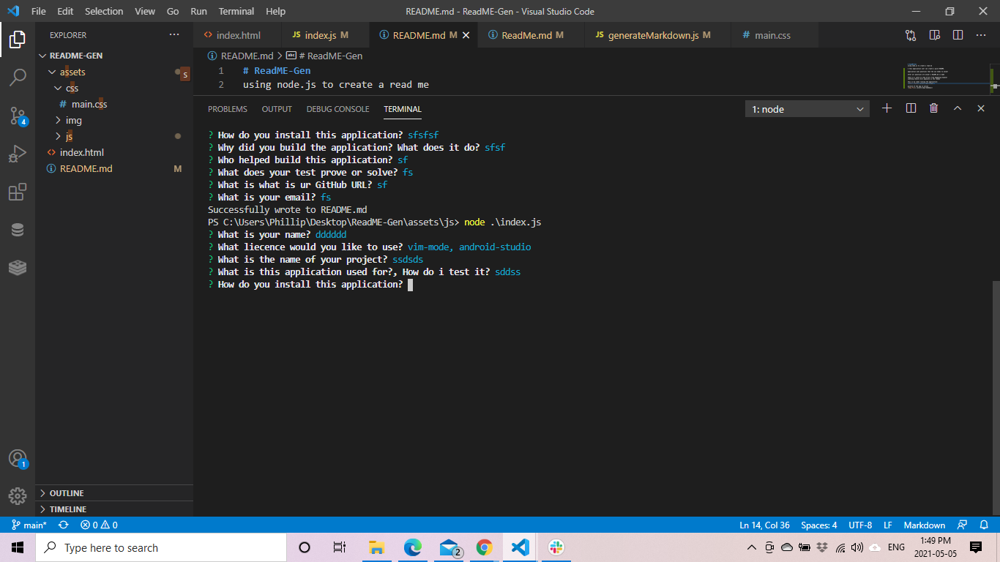
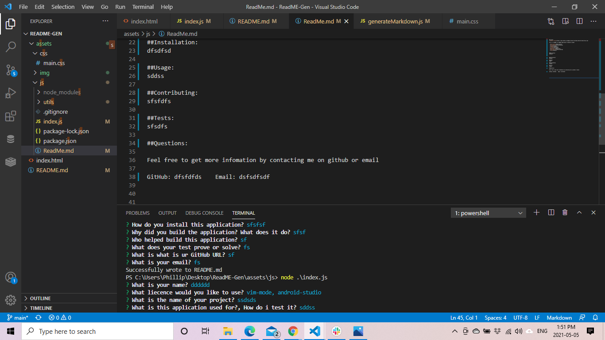

# ReadME-Gen
using node.js to create a read me

I this application user can create a quick README.

application asks questions that the use needs to answer

after all questions are answer a ReadMe.md is made 

there is a catch to stop errors from happennig however 
somthing should still populate in the readme 

this is my video running the appliaction:

picture of the app in action 

